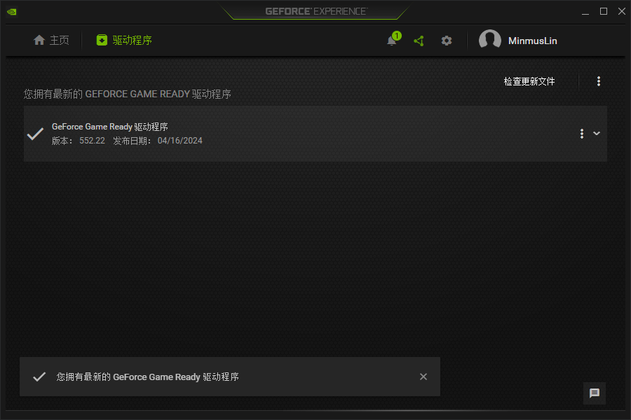
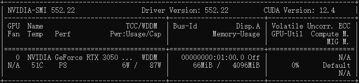
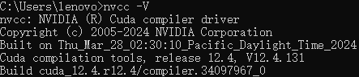
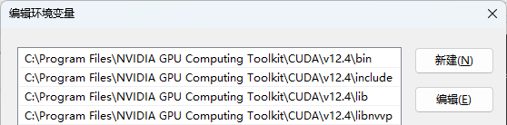
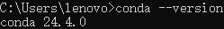
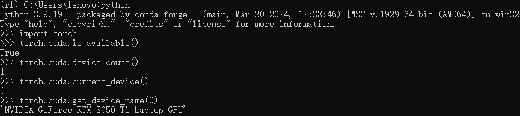

# Flappy Bird Based on DQN

## 项目名称

Flappy_Bird_Based_on_DQN

## 项目简介

Reinforcement Learning Lab: Flappy Bird Game Based on Deep Q-Network.

强化学习实验：基于 Deep Q-Network 的 Flappy Bird 游戏。

## 项目组成

* `/assets`
存放 `README.md` 文件所需的相关图片资源

* `/models`
模型文件

  * `model`
  训练模型

* `/sprites`
`Pygame` 资源文件

* `/src`
代码文件

  * `deep_q_network.py`
  `DeepQNetwork` 类

  * `flappy_bird.py`
  `FlappyBird` 类

  * `utils.py`
  工具函数

* `/tensorboard`
日志文件

* `test.py`
模型测试脚本

* `train.py`
模型训练脚本

## 环境搭建

1. 安装 [NVIDIA GeForce 驱动程序](https://www.nvidia.cn/geforce/drivers)，并检查 GeForce Game Ready 为最新版本

   

2. 在命令提示符输入 `nvidia-smi` 查看驱动版本和 CUDA 版本

   

3. 安装对应版本的 [CUDA Toolkit](https://developer.nvidia.com/cuda-downloads)，并在命令提示符输入 `nvcc -V` 查看版本信息

   

4. 安装对应版本的 [cuDNN](https://developer.nvidia.com/cudnn-downloads)，将解压后的内容（ `bin`、`include`、`lib` 文件夹 ）移动到 CUDA Toolkit 的安装路径中（默认安装路径为 `C:\Program Files\NVIDIA GPU Computing Toolkit\CUDA\v12.4` ），打开 `include` 文件夹中的 `cudnn_version.h` 查看版本信息

   ```c
   #define CUDNN_MAJOR 9
   #define CUDNN_MINOR 1
   #define CUDNN_PATCHLEVEL 1
   ```

5. 将 CUDA Toolkit 安装路径中的 `bin`、`include`、`lib`、`libnvvp` 文件夹添加至系统环境变量（默认安装路径为 `C:\Program Files\NVIDIA GPU Computing Toolkit\CUDA\v12.4` ）

   

6. 安装 [Anaconda](https://www.anaconda.com)，设置 Anaconda 环境变量，并在命令提示符输入 `conda --version` 查看版本信息

   

8. 创建 Reinforcement Learning conda 环境，Python 版本 3.9.19

   ```bash
   conda create -n rl python==3.9.19
   ```

9. 激活 Reinforcement Learning conda 环境

   ```bash
   conda activate rl
   ```

10. 安装对应版本的 [PyTorch](https://pytorch.org/get-started/locally)

    ```bash
    conda install pytorch torchvision torchaudio pytorch-cuda=12.1 -c pytorch -c nvidia
    ```

11. 验证 GPU 可用性，查询当前系统中可用的 NVIDIA GPU 设备

    ```python
    import torch
    torch.cuda.is_available()
    torch.cuda.device_count()
    torch.cuda.current_device()
    torch.cuda.get_device_name(0)
    ```

    

12. 安装相关包和依赖

    ```bash
    pip install pygame opencv-python tensorboard tensorboardX
    ```

## 项目运行

* 测试模型

  ```bash
  python test.py
  ```

* 训练模型

  ```bash
  python train.py
  ```

* 查看训练数据

  ```bash
  tensorboard --logdir=tensorboard
  ```

## 文档更新日期

2024年5月9日