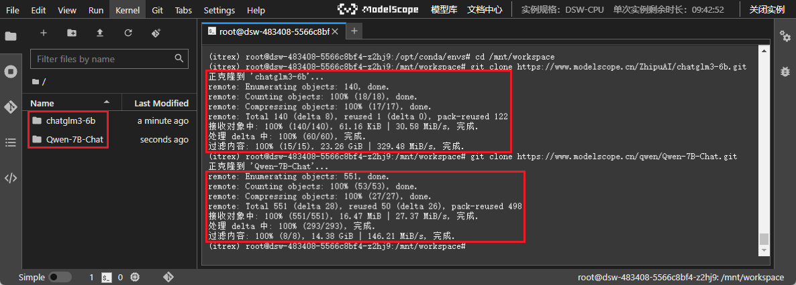
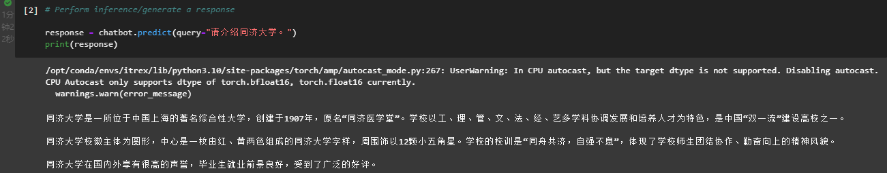
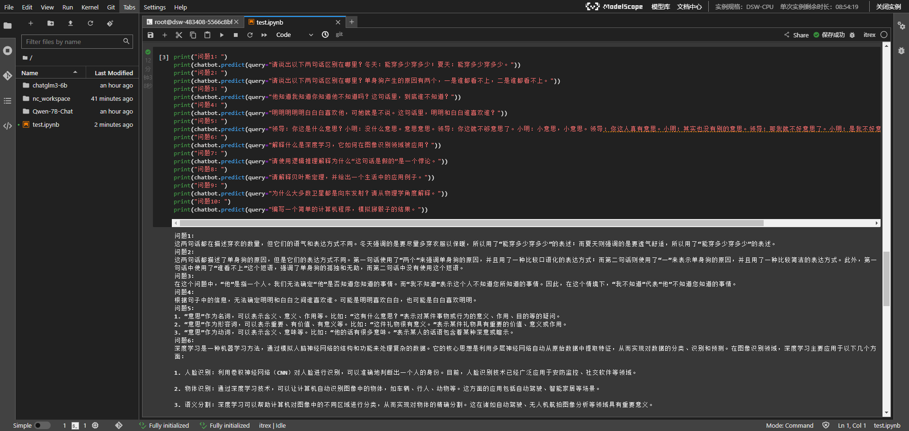
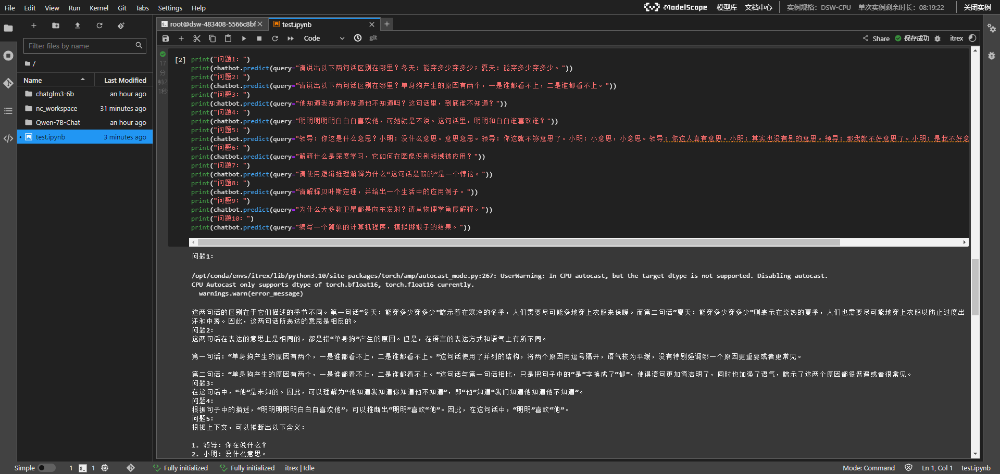

# LLM Deployment

## 项目名称

LLM_Deployment

## 项目简介

Large language model deployment.

大语言模型部署。

## 环境搭建

* 在[魔搭社区](https://www.modelscope.cn)启动 PAI-DSW CPU 环境

  

* 在终端命令行环境中输入下列命令用于在环境目录 `/opt/conda/envs` 下新建文件夹 `itrex`

  ```bash
  cd /opt/conda/envs
  mkdir itrex
  ```

* 使用 `wget` 命令复制运行环境镜像文件并在云主机的 `itrex` 目录进行运行环境的恢复（二选一即可）

  ```bash
  wget https://idz-ai.oss-cn-hangzhou.aliyuncs.com/LLM/itrex.tar.gz
  wget https://filerepo.idzcn.com/LLM/itrex.tar.gz
  ```

* 解压文件

  ```bash
  tar -zxvf itrex.tar.gz -C itrex/
  ```

* 激活环境

  ```bash
  conda activate itrex
  ```

* 安装对应的 Kernel

  ```bash
  python -m ipykernel install --name itrex
  ```

## LLM 下载

* 切换至工作目录

  ```bash
  cd /mnt/workspace
  ```

* 根据实验需要，下载相对应的中文大模型至本地

  ```bash
  git clone https://www.modelscope.cn/ZhipuAI/chatglm3-6b.git
  git clone https://www.modelscope.cn/qwen/Qwen-7B-Chat.git
  ```



## ChatBot 的构建和使用

* 在 Notebook 的 Launcher 中选择基于 itrex 的环境，新建一个 .ipynb 文件 `test.ipynb`

* 量化并构建 ChatBot

* 使用 ChatBot 得到回答

  ```python
  # Perform inference/generate a response

  response = chatbot.predict(query="请介绍同济大学。")
  print(response)
  ```



## 部署大语言模型[智谱 ChatGLM3-6B](https://www.modelscope.cn/models/ZhipuAI/chatglm3-6b/summary)

* 量化并构建 ChatBot

  ```python
  # Build chatbot with INT4 weight-only quantization, computations in AMX INT8

  from intel_extension_for_transformers.neural_chat import build_chatbot, PipelineConfig
  from intel_extension_for_transformers.transformers import RtnConfig

  config = PipelineConfig(model_name_or_path="./chatglm3-6b",
                          optimization_config=RtnConfig(bits=4,
                                                        compute_dtype="int8",
                                                        weight_dtype="int4_fullrange"))

  chatbot = build_chatbot(config)
  ```

* 使用 ChatBot 得到回答

  ```python
  print("问题1：")
  print(chatbot.predict(query="请说出以下两句话区别在哪里？冬天：能穿多少穿多少；夏天：能穿多少穿多少。"))
  print("问题2：")
  print(chatbot.predict(query="请说出以下两句话区别在哪里？单身狗产生的原因有两个，一是谁都看不上，二是谁都看不上。"))
  print("问题3：")
  print(chatbot.predict(query="他知道我知道你知道他不知道吗？这句话里，到底谁不知道？"))
  print("问题4：")
  print(chatbot.predict(query="明明明明明白白白喜欢他，可她就是不说。这句话里，明明和白白谁喜欢谁？"))
  print("问题5：")
  print(chatbot.predict(query="领导：你这是什么意思？小明：没什么意思。意思意思。领导：你这就不够意思了。小明：小意思，小意思。领导：你这人真有意思。小明：其实也没有别的意思。领导：那我就不好意思了。小明：是我不好意思。请问：以上“意思”分别是什么意思。"))
  print("问题6：")
  print(chatbot.predict(query="解释什么是深度学习，它如何在图像识别领域被应用？"))
  print("问题7：")
  print(chatbot.predict(query="请使用逻辑推理解释为什么“这句话是假的”是一个悖论。"))
  print("问题8：")
  print(chatbot.predict(query="请解释贝叶斯定理，并给出一个生活中的应用例子。"))
  print("问题9：")
  print(chatbot.predict(query="为什么大多数卫星都是向东发射？请从物理学角度解释。"))
  print("问题10：")
  print(chatbot.predict(query="编写一个简单的计算机程序，模拟掷骰子的结果。"))
  ```

* 智谱 ChatGLM3-6B 输出结果

  ```
  问题1：
  这两句话都在描述穿衣的数量，但它们的语气和表达方式不同。冬天强调的是要尽量多穿衣服以保暖，所以用了“能穿多少穿多少”的表述；而夏天则强调的是要透气舒适，所以用了“能穿多少穿多少”的表述。
  问题2：
  这两句话都描述了单身狗的原因，但是它们的表达方式不同。第一句话使用了“两个”来强调单身狗的原因，并且用了一种比较口语化的表达方式；而第二句话则使用了“一”来表示单身狗的原因，并且用了一种比较简洁的表达方式。此外，第一句话中使用了“谁看不上”这个短语，强调了单身狗的孤独和无助，而第二句话中没有使用这个短语。
  问题3：
  在这个问题中，“他”是指一个人。我们无法确定“他”是否知道您知道的事情。而“我不知道”表示这个人不知道您所知道的事情。因此，在这个情境下，“我不知道”代表“他”不知道您知道的事情。
  问题4：
  根据句子中的信息，无法确定明明和白白之间谁喜欢谁。可能是明明喜欢白白，也可能是白白喜欢明明。
  问题5：
  1. “意思”作为名词，可以表示含义、意义、作用等。比如：“这有什么意思？”表示对某件事物或行为的意义、作用、目的等的疑问。
  2. “意思”作为形容词，可以表示重要、有价值、有意义等。比如：“这件礼物很有意义。”表示某件礼物具有重要的价值、意义或作用。
  3. “意思”作为动词，可以表示含义、意味等。比如：“他的话有很多意味。”表示某人的话语包含着某种深意或暗示。
  问题6：
  深度学习是一种机器学习方法，通过模拟人脑神经网络的结构和功能来处理复杂的数据。它的核心思想是利用多层神经网络自动从原始数据中提取特征，从而实现对数据的分类、识别和预测。在图像识别领域，深度学习主要应用于以下几个方面：

  1. 人脸识别：利用卷积神经网络（CNN）对人脸进行识别，可以准确地判断出一个人的身份。目前，人脸识别技术已经广泛应用于安防监控、社交软件等领域。

  2. 物体识别：通过深度学习技术，可以让计算机自动识别图像中的物体，如车辆、行人、动物等。这方面的应用包括自动驾驶、智能家居等场景。

  3. 语义分割：深度学习可以帮助计算机对图像中的不同区域进行分类，从而实现对物体的精确分割。这在诸如自动驾驶、无人机航拍图像分析等领域具有重要意义。

  4. 目标检测：利用深度学习技术，可以在图像或视频中实时检测出特定目标的位置和范围，如行人、车辆等。这在智能交通、智能监控等领域具有重要价值。

  5. 风格迁移：深度学习还可以用于将一张图片的风格应用到另一张图片上，从而实现图片
  问题7：
  因为如果这句话是真的，那么它就意味着“这句话是假的”，这会导致自相矛盾的结果。所以，“这句话是假的”是一个悖论。
  问题8：
  贝叶斯定理是概率论中的一个重要定理，它描述了在给定一定条件下，两个随机变量之间的条件概率。具体来说，如果两个随机变量X和Y满足条件P(Y)>0，则X的概率分布可以表示为：P(X=x)=∑y P(Y=y|X=x)P(X=x)。其中，P(Y=y|X=x)表示在已知X=x的情况下，Y取值为y的概率。贝叶斯定理在许多领域都有广泛的应用，例如医学诊断、图像识别和机器学习等。

  以医学诊断为例，假设医生根据患者的症状（如发烧和咳嗽）来判断患者可能患上的疾病（如感冒和肺炎）。在这个问题中，X表示患者的症状，Y表示患者可能患上的疾病。根据贝叶斯定理，我们可以计算出在给定患者症状的情况下，患者患上不同疾病的概率。从而帮助医生做出更准确的诊断。
  问题9：
  大多数卫星都是向东发射，是因为重力作用。在太空中，所有物体都受到引力的影响。地球的重力对卫星产生向下的引力，因此为了使卫星能够克服重力并保持轨道，需要将卫星向东发射，这样卫星的机械能才能增加，以克服地球引力。如果卫星向西发射，它的机械能会减少，因为重力势能会转化为动能，导致卫星速度变慢，最终无法进入轨道。
  问题10：
  以下是一个使用Python编写的简单程序，用于模拟掷骰子的结果：

  import random

  def roll_dice():
      """
      模拟掷骰子的结果。
    
      返回值：
          一个整数，表示掷骰子的结果（1到6）
      """
      return random.randint(1, 6)

  # 测试
  print(roll_dice())

  在这个程序中，我们导入了`random`模块，以便生成随机数。`roll_dice`函数接受无参数，并使用`random.randint(a, b)`方法生成一个在`a`和`b`之间的随机整数。在这里，我们将范围限制在1到6之间。最后，我们调用`roll_dice`函数并打印结果来测试它。
  ```



## 部署大语言模型[通义千问 Qwen-7B-Chat](https://www.modelscope.cn/models/qwen/Qwen-7B-Chat/summary)

* 量化并构建 ChatBot

  ```python
  # Build chatbot with INT4 weight-only quantization, computations in AMX INT8

  from intel_extension_for_transformers.neural_chat import build_chatbot, PipelineConfig
  from intel_extension_for_transformers.transformers import RtnConfig

  config = PipelineConfig(model_name_or_path="./Qwen-7B-Chat",
                          optimization_config=RtnConfig(bits=4,
                                                        compute_dtype="int8",
                                                        weight_dtype="int4_fullrange"))

  chatbot = build_chatbot(config)
  ```

* 使用 ChatBot 得到回答（问题同上）

* 通义千问 Qwen-7B-Chat 输出结果

  ```
  问题1：
  这两句话的区别在于它们描述的季节不同。第一句话“冬天：能穿多少穿多少”暗示着在寒冷的冬季，人们需要尽可能多地穿上衣服来保暖。而第二句话“夏天：能穿多少穿多少”则表示在炎热的夏季，人们也需要尽可能地穿上衣服以防止过度出汗和中暑。因此，这两句话所表达的意思是相反的。
  问题2：
  这两句话在表达的意思上是相同的，都是指“单身狗”产生的原因。但是，在语言的表达方式和语气上有所不同。

  第一句话：“单身狗产生的原因有两个，一是谁都看不上，二是谁都看不上。”这句话使用了并列的结构，将两个原因用逗号隔开，语气较为平缓，没有特别强调哪一个原因更重要或者更常见。

  第二句话：“单身狗产生的原因有两个，一是谁都看不上，二是谁都看不上。”这句话与第一句话相比，只是把句子中的“是”字换成了“都”，使得语句更加简洁明了，同时也加强了语气，暗示了这两个原因都很普遍或者很常见。
  问题3：
  在这句话中，“他”是未知的。因此，可以理解为“他知道我知道你知道他不知道”，即“他”知道“我们知道他知道他不知道”。
  问题4：
  根据句子中的描述，“明明明明明白白白喜欢他”，可以推断出“明明”喜欢“他”。因此，在这句话中，“明明”喜欢“他”。
  问题5：
  根据上下文，可以推断出以下含义：

  1. 领导：你在说什么？
  2. 小明：没什么意思。
  3. 领导：你这就不够意思了。
  4. 小明：小意思，小意思。
  5. 领导：你这人真有意思。
  6. 小明：其实也没有别的意思。
  7. 领导：那我就不好意思了。
  8. 小明：是我不好意思。

  因此，“意思”的含义分别是：话语的内容、没有意义或价值、不尊重、有趣、真实的意思、感到尴尬、抱歉。
  问题6：
  深度学习是一种机器学习技术，它使用多层神经网络来模拟人脑的思维过程。它可以自动从数据中提取特征，并通过训练模型来实现对未知数据的预测和分类。

  在图像识别领域，深度学习可以用来识别和分类图像中的物体。例如，我们可以使用深度学习模型来识别猫、狗、汽车等物体。首先，我们需要准备大量的标记图像作为训练数据，然后使用深度学习模型进行训练，使其能够从图像中提取出有用的特征，并根据这些特征进行分类。最后，我们可以在新的未标记图像上测试模型，看看它是否能够正确地识别出图像中的物体。
  问题7：
  悖论是指一个陈述或论证，其本身包含自相矛盾的信息，从而导致无法得出确定性的结论。在这种情况下，即使我们试图通过逻辑推理来证明这个陈述的真实性，也无法得到一致的结果。

  例如，假设我们有一个陈述：“这句话是假的。” 这个陈述看起来像是在说自己的真实性，但实际上它包含了自我矛盾的信息。如果这个陈述是真的，那么它就是假的，这与我们的初始陈述相矛盾。然而，如果我们认为这个陈述是假的，那么它又是真的，这也与我们的初始陈述相矛盾。

  因此，无论我们如何尝试通过逻辑推理来证明这个陈述的真实性，都无法得出确定性的结论。这就是悖论的本质。
  问题8：
  贝叶斯定理是一种概率论和统计学的方法，用于计算在给定一些先验知识的情况下，某个事件发生的可能性。它基于条件概率的概念，即在已知某些信息的情况下，另一个事件的概率。

  公式表示为：P(A|B) = P(B|A) * P(A) / P(B)

  其中：
  - P(A|B) 是在 B 发生的条件下 A 发生的概率。
  - P(B|A) 是在 A 发生的条件下 B 发生的概率。
  - P(A) 是 A 发生的概率。
  - P(B) 是 B 发生的概率。

  在生活中，贝叶斯定理有很多实际的应用。例如，在医学诊断中，医生可以根据病人的症状和检查结果来判断病人是否患有某种疾病。在这种情况下，病人的症状可以看作是先验知识，而检查结果则是新的信息。根据贝叶斯定理，我们可以计算出在检查结果为阳性的情况下，病人真正患有该疾病的概率。这样可以帮助医生做出更准确的诊断决策。
  问题9：
  大多数卫星都是向东发射，主要是因为地球的自转方向是从西向东，因此在地球上观察到的卫星运动方向也是向东。此外，向东发射卫星也有助于减少卫星的轨道倾角，从而降低燃料消耗和延长卫星寿命。

  具体来说，卫星的发射速度需要足够大以克服地球引力并进入预定轨道。如果卫星向西发射，那么它必须达到更高的发射速度才能克服地球引力，这将增加燃料消耗。相反，如果卫星向东发射，那么它可以使用较低的发射速度，从而节省燃料。

  此外，向东发射卫星还可以帮助卫星保持较低的轨道倾角。地球的自转使得地球表面的物体倾向于向东移动，因此向东发射卫星可以使其轨道尽可能接近地球赤道线，从而减少由于地球自转引起的轨道倾角变化，从而降低燃料消耗和延长卫星寿命。

  总的来说，向东发射卫星是基于物理学原理和实际应用需求做出的选择，旨在最大限度地提高卫星的有效载荷能力、降低燃料消耗和延长卫星寿命。
  问题10：
  这是一个使用Python编写的简单程序，它模拟掷骰子的结果：

  import random

  def roll_dice():
      return random.randint(1, 6)

  print("Rolling the dice...")
  print("Result:", roll_dice())

  在这个程序中，我们首先导入了random模块，然后定义了一个名为roll_dice的函数，该函数返回随机生成的1到6之间的整数。

  在主程序部分，我们调用roll_dice函数并打印结果。每次运行程序时，都会得到一个新的随机骰子结果。
  ```



## 大语言模型横向比对分析

根据提供的 10 个示例问题和两个大语言模型（智谱 ChatGLM3-6B 和通义千问 Qwen-7B-Chat）的输出，我们对这两个大语言模型进行横向比对：

* 语言流畅性和可读性
  * 智谱 ChatGLM3-6B：输出较为正式和条理清晰。它通常在回答中提供详细的解释和论述，尤其在技术性或需要详细解释的问题上表现良好。
  * 通义千问 Qwen-7B-Chat：语言表达较为直接，有时语气更加口语化。在处理复杂语义或含有双关语的问题时，倾向于提供更加简洁和直观的回答。
* 处理复杂问题的能力
  * 智谱 ChatGLM3-6B：在处理需要多层次理解和逻辑推理的问题时，如“这句话是假的”悖论，提供了更深入的分析和解释。
  * 通义千问 Qwen-7B-Chat：在解释复杂概念或回答技术性问题时，有时倾向于过度简化，但这也有助于快速理解基本概念。
* 幽默感和创造力
  * 智谱 ChatGLM3-6B：在需要创造性或幽默性回答的问题上，如“意思意思”的对话，提供了丰富的语义解析，展示出能够理解和处理多义词的能力。
  * 通义千问 Qwen-7B-Chat：对于含有多义性或语言游戏的问题，能够给出具有创造性的回答，显示出灵活处理语言的能力。
* 准确性和专业知识
  * 智谱 ChatGLM3-6B：在需要专业知识的回答中，如深度学习的应用，提供了详尽的解释和多个例子，显示出较好的知识储备。
  * 通义千问 Qwen-7B-Chat：在处理专业问题时，能够准确快速地给出核心信息，尽管有时细节不如智谱 ChatGLM3-6B丰富。
* 回答的一致性和逻辑性
  * 智谱 ChatGLM3-6B：在逻辑推理和答案的一致性方面表现较好，尤其是在需要连续逻辑步骤的问题上。
  * 通义千问 Qwen-7B-Chat：回答简洁且直接，逻辑通常清晰，但有时可能在更复杂的逻辑链条上表现略逊一筹。

智谱 ChatGLM3-6B 大语言模型的优势和不足如下：

* 优点
  * 深入详尽：在需要深层解释和技术性解答的问题上，如深度学习的应用，ChatGLM3-6B 能够提供丰富的信息和详细的解释。
  * 逻辑严密：在处理逻辑推理或悖论问题时，如“这句话是假的”悖论，表现出较高的逻辑一致性和深度。
* 不足
  * 回答冗长：有时候，尤其在复杂问题上，ChatGLM3-6B 的回答可能过于详细，导致信息量大但不够精炼，可能影响信息的快速获取和消化。
  * 语言僵硬：在某些回答中，语言表达可能显得过于书面化，缺乏口语化交流的自然流畅性，这在需要与用户进行自然对话的场景中可能是一个缺点。

通义千问 Qwen-7B-Chat 大语言模型的优势和不足如下：

* 优点
  * 直接明了：在许多问题的回答中，Qwen-7B-Chat 提供直接且容易理解的答案，特别是在解释概念或直接回答简单问题时。
  * 语言自然：语言表达较为口语化，更符合日常对话的习惯，这有助于提高用户的接受度和互动的自然性。
* 不足
  * 处理复杂逻辑的能力有限：在需要多层次逻辑分析的问题上，如解释悖论或复杂科技问题时，Qwen-7B-Chat 的回答有时候可能显得过于简化，缺乏必要的深度和详尽性。
  * 细节处理不足：在一些需要详细背景知识的答案中，如深度学习在图像识别中的应用，可能没有提供足够的示例或深入的技术细节，这可能导致专业用户对答案的满意度不高。

总体而言，智谱 ChatGLM3-6B 适合处理需要深度知识和详细解释的场合，而通义千问 Qwen-7B-Chat 更适合日常对话和需要快速答案的情境。两者的选择应基于具体的应用场景和用户需求。

## 文档更新日期

2024年5月29日