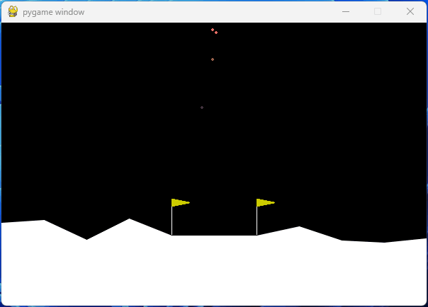
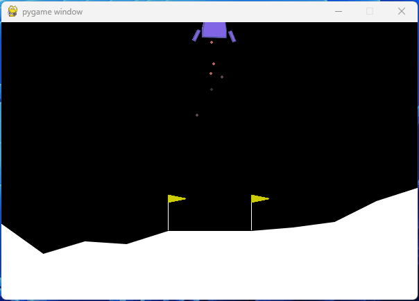
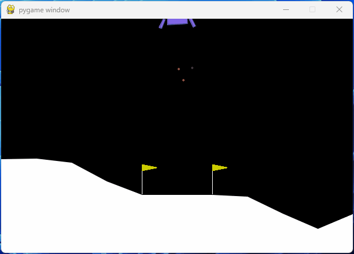
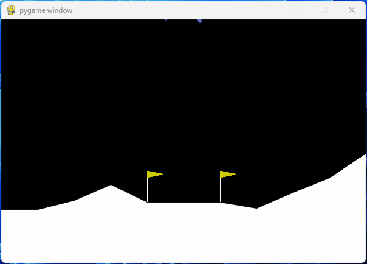
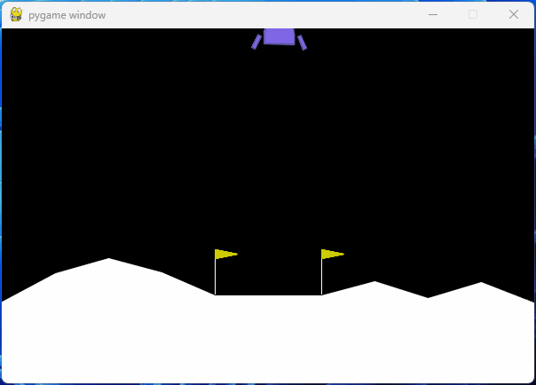
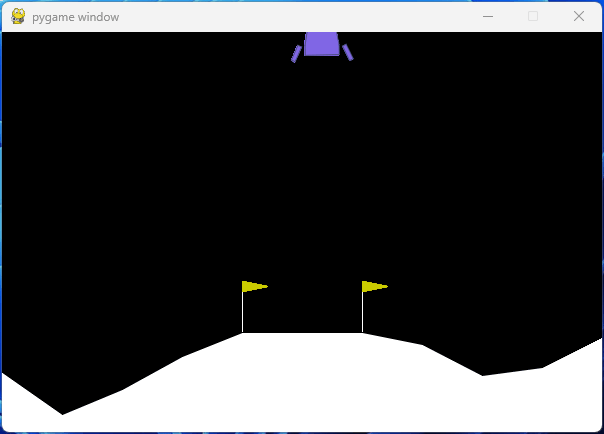
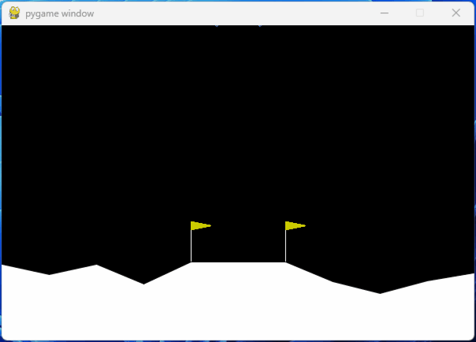
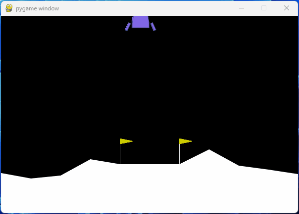
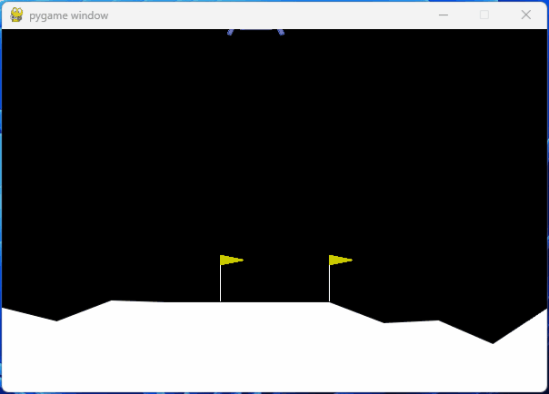
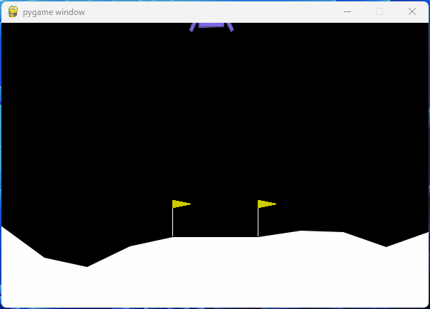

# Lunar Lander Based on DQN

## 项目名称

Lunar_Lander_Based_on_DQN

## 项目简介

Reinforcement Learning Lab: Lunar Lander Based on Deep Q-Network.

强化学习实验：基于 Deep Q-Network 的月球着陆器。


## 项目组成

* `/assets`
存放 `README.md` 文件所需的相关图片资源

* `/models`
模型文件

* `/src`
代码文件

  * `agent.py`
  `LunarLanderAgent` 类

  * `dataset.py`
  `ReplayBufferDataset` 类

  * `dqn.py`
  `QFunc` 类

  * `train.py`
  `Trainer` 类

* `Report.pptx`
实验报告 PPT

* `test.py`
模型测试脚本

* `train.py`
模型训练脚本

## 环境搭建

1. 安装 [Anaconda](https://www.anaconda.com)，设置 Anaconda 环境变量，并在命令提示符输入 `conda --version` 查看版本信息

2. 创建 Reinforcement Learning conda 环境，Python 版本 3.9.19

   ```bash
   conda create -n rl python==3.9.19
   ```

3. 激活 Reinforcement Learning conda 环境

   ```bash
   conda activate rl
   ```

4. 安装相关依赖

    ```bash
    conda install numpy \
        torch \
        gymnasium[box2d] \
        tqdm \
        tensorboard \
        tensorboardX
    ```

## 项目运行

* 测试模型

  ```bash
  python test.py
  ```

* 训练模型

  ```bash
  python train.py
  ```

* 查看训练数据

  ```bash
  tensorboard --logdir=tensorboard
  ```

## 不同迭代次数表现

<p align="center">
  
  
  
  
  
  <br>5 / 10 / 15 / 20 / 25 Iterations<br>
  
  
  
  
  
  <br>30 / 35 / 40 / 45 / 50 Iterations<br>
</p>

## 文档更新日期

2024年5月28日